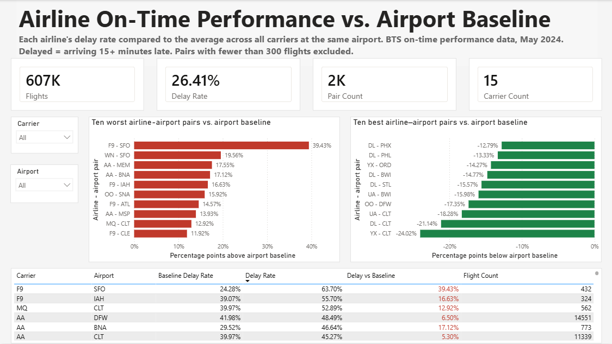

# Airline On-Time Performance vs. Airport Baseline



A Power BI analysis of U.S. domestic flight data that ranks airline–airport pairs by how they perform *relative to other carriers at the same airport*, rather than by raw on-time percentage.

**Data:** Bureau of Transportation Statistics, Reporting Carrier On-Time Performance, May 2024 (607,000 flights, 15 carriers, ~2,000 airline–airport pairs).

---

## The question

Which airline–airport pairs have the worst on-time performance relative to what their route mix would predict?

Raw on-time rankings mostly measure *where an airline flies*. A carrier concentrated in congested Northeast hubs will look worse than one flying uncongested Western routes, even if the first is better run. Comparing each airline only against the other carriers operating out of the same airport removes the airport's difficulty from the comparison and leaves something closer to operational performance.

## Method

1. Filtered out cancelled and diverted flights, which have no arrival delay value.
2. Flagged each remaining flight as delayed using the BTS standard: arriving 15 or more minutes late.
3. Calculated a delay rate for each airline–airport pair.
4. Calculated a baseline for each airport — the delay rate across *all* carriers operating there — using a DAX measure that strips the carrier filter while preserving the airport context.
5. Took the difference. Positive means the carrier underperforms its peers at that airport; negative means it outperforms them.
6. Excluded pairs with fewer than 300 flights in the month.

### Key measures

```dax
Delay Rate = AVERAGE('T_ONTIME_REPORTING'[IsDelayed])

Baseline Delay Rate =
VAR CurrentOrigin = SELECTEDVALUE('T_ONTIME_REPORTING'[ORIGIN])
RETURN
CALCULATE(
    [Delay Rate],
    ALL('T_ONTIME_REPORTING'),
    'T_ONTIME_REPORTING'[ORIGIN] = CurrentOrigin
)

Delay vs Baseline =
IF([Flight Count] >= 300, [Delay Rate] - [Baseline Delay Rate])
```

### On the flight threshold

At no minimum, the rankings are dominated by pairs with a handful of flights and extreme percentages that reflect sample size rather than performance. Raising the floor to 100 removed the worst of it; raising it to 300 changed the composition of the top ten again, which suggests the rankings remain somewhat sample-sensitive even at that level. The 300-flight results are reported here because they are the most conservative.

---

## What the data shows

**Frontier (F9) underperforms across its network, not at any single airport.** It appears four times in the ten worst pairs — San Francisco, Houston, Atlanta, and Cleveland. Its San Francisco operation ran a 63.7% delay rate against a 24.3% airport baseline, a gap of 39 percentage points. A carrier appearing at four unrelated airports after controlling for airport difficulty points to something systemic rather than local.

**American (AA) shows a similar pattern at lower magnitude**, appearing at Memphis, Nashville, and Minneapolis in the worst ten, with smaller gaps at its major hubs.

**Delta (DL) outperforms its baseline consistently**, appearing at Phoenix, Philadelphia, Baltimore, St. Louis, and Charlotte among the ten best. Its regional partner Republic (YX) appears at Chicago O'Hare and Charlotte.

**Large-sample results deserve more weight than large gaps.** American at Dallas–Fort Worth ran 6.5 points above baseline across 14,551 flights; American at Charlotte ran 5.3 points above across 11,339. These are smaller differences than the extremes on the chart but rest on far more data, and are correspondingly harder to dismiss as noise.

---

## What this analysis does not establish

- **Cause.** A pair performing above baseline could reflect operational execution, schedule design with tight turnarounds, aircraft age, hub cascade effects, or gate and crew constraints. This identifies where to look, not why.
- **Seasonality.** One month of data. A carrier having a poor May is indistinguishable here from a carrier with a persistent problem. Repeating the analysis across additional months would separate the two.
- **Cancellations.** Cancelled flights are excluded, so a carrier that cancels aggressively during disruption appears more punctual than its passengers experienced. Delay rate and cancellation rate should be read together.
- **Time-of-day composition.** Delay accumulates through the day as aircraft fall behind. A carrier whose schedule skews toward late departures faces a structural disadvantage this method does not adjust for.
- **Regional carrier attribution.** Flights are attributed to the operating carrier code. Regional operators flying under a mainline brand appear separately, so a mainline carrier's full customer-facing performance is split across multiple codes.
- **Sample sensitivity.** The composition of the top ten changed between the 100-flight and 300-flight thresholds, which means the specific ranking is less stable than the broader carrier-level pattern.

---

## Built with

Power BI Desktop — Power Query for cleaning and transformation, a star-schema model with a carrier lookup, and DAX measures for the baseline comparison.

## Files

- `airline-ontime-baseline.pbix` — the Power BI report
- `dashboard.png` — screenshot of the finished dashboard
